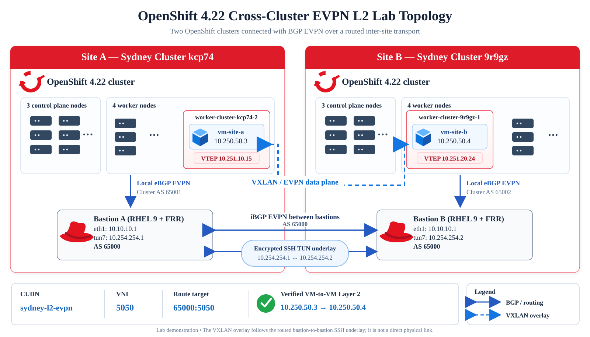

# OpenShift 4.22 — Cross-Cluster Layer 2 EVPN

Two independent OpenShift 4.22 clusters sharing a Layer 2 user-defined network across sites. Each cluster peers with a local RHEL 9/FRR bastion using BGP EVPN; the bastions exchange EVPN routes over an encrypted SSH tunnel that also carries the routed VXLAN traffic.

## Topology



## Lab configuration

| | Site A (kcp74) | Site B (9r9gz) |
|---|---|---|
| OpenShift nodes | 3 control plane + 4 workers | 3 control plane + 4 workers |
| Cluster ASN | 65001 | 65002 |
| Bastion ASN | 65000 | 65000 |
| SSH tunnel | `10.254.254.1` | `10.254.254.2` |
| VTEP subnet | `10.251.10.0/24` | `10.251.20.0/24` |
| VM-host VTEP | `10.251.10.15` | `10.251.20.24` |
| Demo VM | `vm-site-a` · `10.250.50.3` | `vm-site-b` · `10.250.50.4` |

**Shared network:** `sydney-l2-evpn` · VNI `5050` · route target `65000:5050` · `10.250.50.0/24`.

## Validation

The two VM-host VTEPs communicate across sites, both clusters learn remote EVPN routes, and **`vm-site-a` successfully pinged `vm-site-b` (4/4 replies)**. Its ARP entry resolved the remote VM's MAC, confirming Layer 2 reachability.

From the repository root, with `SITE_A_CONTEXT` and `SITE_B_CONTEXT` set to your `oc` contexts:

```bash
./scripts/04-test.sh --full
```

To test guest connectivity, open the Site A VM console:

```bash
virtctl --context="$SITE_A_CONTEXT" -n evpn-demo console vm-site-a
# Inside the VM:
ping -c 4 10.250.50.4
```

The VM IPs shown above were observed in this lab; DHCP may assign different addresses in a fresh deployment.

## Files and documentation

- [Site A](site-a/) and [Site B](site-b/): OpenShift EVPN, VTEP, NMState and VM manifests.
- [Fabric](fabric/) and [inventory](inventory/): FRR configurations and node addresses.
- [Scripts](scripts/): setup, deployment and testing.
- [Operations](docs/OPERATIONS.md) · [Fabric checklist](docs/FABRIC-CHECKLIST.md) · [Recovery](docs/RECOVERY.md): detailed procedures.

> **Lab demonstration:** The SSH tunnel, temporary node routes and firewall rules are not a production inter-site or highly available network design.
