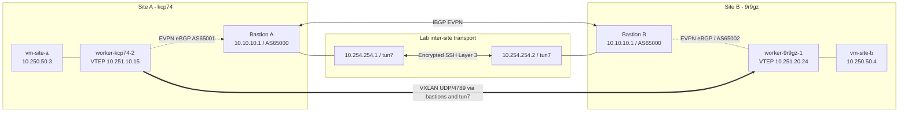

# OpenShift 4.22: two-cluster Layer 2 CUDN over BGP EVPN

**Working Sydney two-site lab, verified 25 September 2026.** Two independent bare-metal OpenShift 4.22 clusters exchange Layer 2 CUDN EVPN routes via FRR running on their RHEL 9 bastions. An OpenSSH point-to-point TUN tunnel carries the routed VXLAN data plane between the otherwise isolated workshop networks.

> **Lab only:** this deliberately uses an SSH tunnel over published workshop SSH gateway ports, runtime node routes and runtime nftables exceptions. It is not a production inter-site underlay or HA design. Authorised access and network permissions are required. No SSH private keys, OpenShift tokens or VM passwords are included.

## Evidence from the completed lab

- Site A and B `sydney-vtep` are `Accepted=True`; both CUDNs report all three success conditions.
- Seven OpenShift nodes on each site peer with their **local** bastion (`10.10.10.1`, AS65000). Bastions are **iBGP EVPN** peers through the SSH tunnel.
- VM-host FRR reported **13 remote/local-other VTEPs** for VNI `5050` at each site after the switch (VNI/RT `5050` / `65000:5050`). Both bastions learned 14 EVPN type-3 routes.
- The VM-host VTEPs `10.251.10.15` and `10.251.20.24` ping in both directions without loss.
- **Final guest proof:** `vm-site-a` at `10.250.50.3` pinged `vm-site-b` at `10.250.50.4`: 4/4 replies. Its ARP entry resolved `10.250.50.4 → 0a:58:0a:fa:32:04` as `REACHABLE`.

The reported guest IPs are **observed DHCP allocations**, not an IPAM guarantee for a fresh rebuild. Check for collisions on a fresh deployment and use a properly coordinated address plan.

## Topology



The two sites legitimately reuse `10.10.10.0/24` for local node/bastion management. **Never** advertise or route that overlapping subnet through the inter-site tunnel. Only the distinct VTEP ranges cross it. The earlier `172.31.250.0/24` VTEP range was wrong because it overlapped the clusters' `172.31.0.0/16` service CIDR.

| Item | Site A | Site B |
|---|---|---|
| OpenShift API | `api.cluster-kcp74.dyn.redhatworkshops.io:6443` | `api.cluster-9r9gz.dyn.redhatworkshops.io:6443` |
| Published SSH gateway | `ssh.ocpv02.rhdp.net:31482` | `ssh.ocpv08.rhdp.net:31156` |
| Bastion local interface | `eth1: 10.10.10.1/24` | `eth1: 10.10.10.1/24` |
| Cluster / bastion ASNs | `65001` / `65000` | `65002` / `65000` |
| Tunnel address | `10.254.254.1` | `10.254.254.2` |
| Routed VTEP range | `10.251.10.0/24` | `10.251.20.0/24` |
| VM-host VTEP | `10.251.10.15` | `10.251.20.24` |
| VM observed IP | `10.250.50.3` | `10.250.50.4` |
| VM MAC | `0a:58:0a:fa:32:03` | `0a:58:0a:fa:32:04` |

Both CUDNs: `sydney-l2-evpn`, primary Layer 2, `10.250.50.0/24`, VNI `5050`, route target `65000:5050`, VTEP `sydney-vtep`, namespace `evpn-demo`.

## Repository layout

```text
ocp422-evpn-l2-demo/
├── README.md
├── .gitignore
├── LICENSE
├── .github/workflows/ci.yml
├── inventory/site-{a,b}.tsv                # Verified workshop node/VTEP mapping
├── fabric/site-{a,b}-frr.conf             # Bastion FRR 8.5 reference configs
├── site-a/                               # Actual AS65001, peer 10.10.10.1, VTEP 10.251.10/24
│   ├── 01-frrconfiguration.yaml
│   ├── 02-vtep.yaml
│   ├── 05-vm-site-a.yaml                 # SSH key rendered locally by deploy script
│   └── nncp/                            # Seven node-specific /32 dummy VTEPs
├── site-b/                               # Corresponding AS65002 and 10.251.20/24
├── shared/                               # Namespace, RouteAdvertisements, CUDN
├── scripts/
│   ├── 00-login.sh                      # Save context names, not credentials
│   ├── 00-preflight.sh
│   ├── 01-enable-cluster-networking.sh
│   ├── 02-deploy-site-a.sh
│   ├── 03-deploy-site-b.sh
│   ├── 04-test.sh                       # Correct .3 -> .4 guest test
│   ├── 05-configure-vteps.sh
│   ├── 05-start-tunnel.sh
│   ├── 06-complete-fabric.sh             # Proven v4 staged FRR/fabric/switch helper
│   └── 07-restore-node-routes.sh
├── docs/OPERATIONS.md
├── docs/FABRIC-CHECKLIST.md
├── docs/RECOVERY.md
└── tests/                               # Offline Bash and YAML tests
```

## Prerequisites

- Authorised `cluster-admin` access to **both** bare-metal OpenShift 4.22 clusters with OVN-Kubernetes, OpenShift Virtualization and Kubernetes NMState.
- Mac or Linux shell with `oc`, `virtctl`, `jq`, `ssh`, `scp`, `python3`, `bash` and `git`. Existing `oc` context names may be used without re-login.
- Both RHEL 9 bastions reachable via the **specific SSH gateway ports above**, working `sudo -n`, FRR 8.5 and an authenticated Bastion A → B SSH connection. The lab demonstrated one-way initiation is sufficient.
- On Bastion B: authorisation to set `PermitTunnel point-to-point` in `sshd`, TUN access for `lab-user`, and a trusted Bastion A public key in B's `authorized_keys`. Never check a private key into Git.
- Distinct VTEP ranges, TCP/179 from cluster nodes to their local bastion, VXLAN UDP/4789 **inside the routed tunnel**, bidirectional TUN transport. Set bastion `tun7` MTU to `1500` for the demonstrated 1300-byte guest MTU; validate application MTU separately.

The cluster settings required by OCP 4.22 EVPN—FRR provider, route advertisements, `routingViaHost: true` and `ipForwarding: Global`—are checked by `00-preflight.sh` and can be enabled by `01-enable-cluster-networking.sh`. Refer to the [Red Hat OCP 4.22 EVPN documentation](https://docs.redhat.com/en/documentation/openshift_container_platform/4.22/html/advanced_networking/bgp-evpn-for-user-defined-networks).

## Quick start: the **already-working** 25 September lab

You **do not need to redeploy the current VMs or rerun `switch`**. Run from the repository root:

```bash
export SITE_A_CONTEXT='default/api-cluster-kcp74-dyn-redhatworkshops-io:6443/admin'
export SITE_B_CONTEXT='default/api-cluster-9r9gz-dyn-redhatworkshops-io:6443/admin'
./scripts/05-start-tunnel.sh status
./scripts/06-complete-fabric.sh bgp-check
./scripts/04-test.sh --full

# If you have just pinged between the guests:
./scripts/04-test.sh --strict
```

Run the confirmed VM-to-VM test inside Site A's guest:

```bash
virtctl --context="$SITE_A_CONTEXT" -n evpn-demo console vm-site-a
# Inside the VM (actual observed IPs from this lab):
ping -c 4 10.250.50.4 && ip neigh show 10.250.50.4
```

The previous `10.250.50.12` instruction was incorrect: it referred to an earlier **unapplied** cloud-init template. The demonstrated working Site B guest is `.4`.

## Fresh lab: ordered procedure

**Do not run these provisioning commands against an already-working environment.** The commands below apply the 2026-09-25 workshop topology; adjust inventory and addresses for different clusters and verify address availability before any change.

1. Log in and enable routing features: `./scripts/00-login.sh`, `./scripts/00-preflight.sh`, then `./scripts/01-enable-cluster-networking.sh site-a` and `site-b`. Existing users can export contexts instead of re-login. Verify both API URLs are distinct.
2. On Bastion A, create a local SSH identity if needed; authorise its **public** key on Bastion B via approved credentials. On Bastion B, use an approved `sshd_config.d` drop-in containing `PermitTunnel point-to-point`, validate `sshd -t`, reload SSH, and ensure `sudo -n true` succeeds. See [Operations](docs/OPERATIONS.md) for the exact commands. Use `./scripts/05-start-tunnel.sh start` and confirm both tunnel pings.
3. Run `./scripts/05-configure-vteps.sh site-a apply` and `./scripts/05-configure-vteps.sh site-b apply` to create the **14 durable NNCP dummy interfaces**. The script refuses to overwrite an existing NNCP with a different address.
4. Apply the **network resources before the fabric stage** so the VTEP CR can populate node annotations: run `./scripts/02-deploy-site-a.sh --network-only` and `./scripts/03-deploy-site-b.sh --network-only`. These apply the namespace, already-created NNCPs, `VTEP`, BGP peer CR, RouteAdvertisements and CUDN, but no VM. Then run `./scripts/06-complete-fabric.sh frr-check` and `./scripts/06-complete-fabric.sh fabric`. The fabric helper discovers the live node routes, installs narrow nftables VTEP exceptions, validates FRR 8.5 syntax on **both actual bastions** and sets up inter-bastion iBGP EVPN.
5. **Before first cross-site guest traffic**, run `./scripts/06-complete-fabric.sh switch` to install temporary remote VTEP routes on all nodes. It also migrates old VTEPs and BGP peers if necessary. It backs up both clusters outside the repository and prompts for `SWITCH`. If deploying fresh after step 3, the IP update is already in place; `switch` is still used for the host routes. Do not rerun repeatedly on the live lab.
6. Run `./scripts/02-deploy-site-a.sh` and `./scripts/03-deploy-site-b.sh` to add VMs. These commands safely reapply the network resources already created in step 4. Existing VMs are left untouched. To create a new VM, supply `VM_SSH_PUBLIC_KEY` or `VM_SSH_PUBLIC_KEY_FILE`—no password is committed to the repo. **Verify that the two guests receive distinct addresses**; fresh DHCP does not guarantee `.3` and `.4`.
7. Run `./scripts/06-complete-fabric.sh verify`, `./scripts/04-test.sh --full` and the guest ping; finally `./scripts/04-test.sh --strict` to check learned remote VM MACs. For newly rendered key-only guests, use `virtctl --context="$SITE_A_CONTEXT" -n evpn-demo ssh -i ~/.ssh/id_ed25519 demo@vm/vm-site-a` if that Fedora image has an active SSH server; otherwise arrange approved guest console access during image preparation.

The exact successful `frr-check → fabric → switch → verify` sequence is retained in `scripts/06-complete-fabric.sh`, including the critical FRR **numeric PfxRcd** gate. An established session with zero prefixes displays `0`, not the word `Established`.

## Recovery, security and GitHub publishing

- For an SSH disconnect: `./scripts/05-start-tunnel.sh start`. After a **bastion/node reboot**, additionally run `./scripts/07-restore-node-routes.sh`, which restores temporary bastion routes/firewall and temporary worker routes without restarting healthy BGP. Read [Recovery](docs/RECOVERY.md) first.
- OpenShift NNCP configuration persists, but the `ip route replace` commands, runtime nftables rules and user-launched SSH process **do not** survive every reboot. Build a proper routed/failover underlay for anything beyond this workshop.
- Never publish `.site-contexts.env`, `.kube`, SSH private keys, workshop credentials or raw `oc login` output. The previous lab used a demo password; this repository replaces it with runtime SSH-public-key injection for **new** VMs. Existing deployed VM credentials are unchanged.
- To publish locally: `git init`, `git add .`, `git commit -m 'Working OCP 4.22 cross-cluster EVPN lab'`, then create a repository in GitHub and add/push its remote. Do not commit generated backups or local identity files.

**Reference docs:** [OCP 4.22 BGP EVPN for user-defined networks](https://docs.redhat.com/en/documentation/openshift_container_platform/4.22/html/advanced_networking/bgp-evpn-for-user-defined-networks) · [OCP route advertisements](https://docs.redhat.com/en/documentation/openshift_container_platform/4.22/html/advanced_networking/route-advertisements) · [FRRouting BGP](https://docs.frrouting.org/en/latest/bgp.html).
